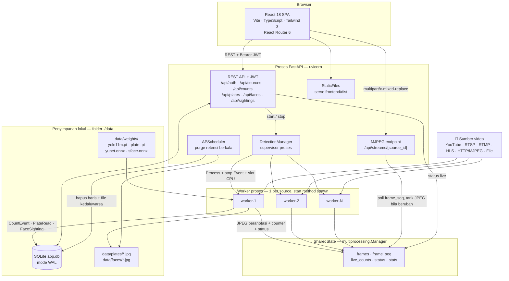
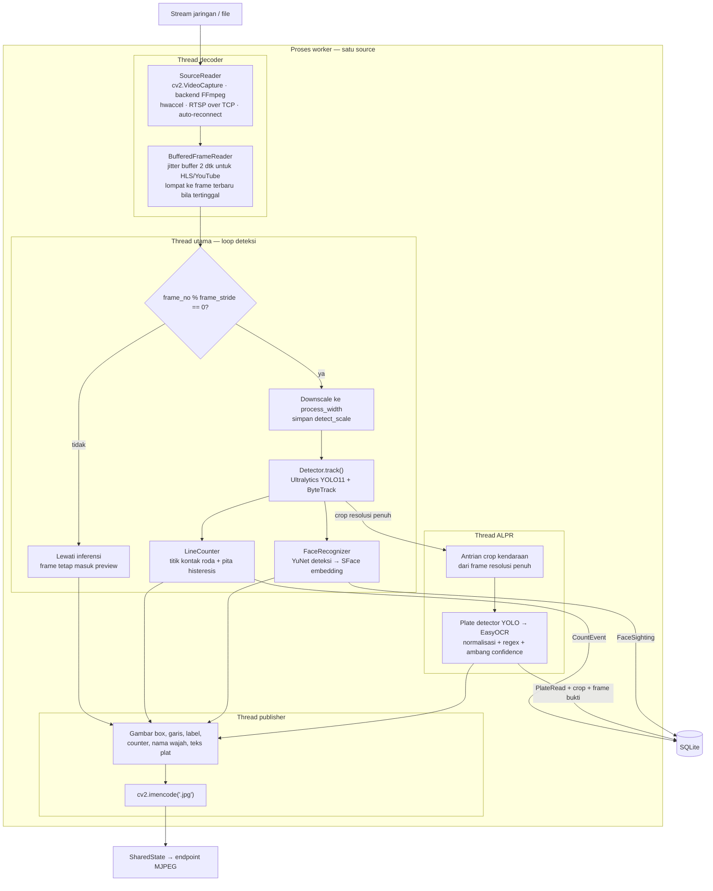
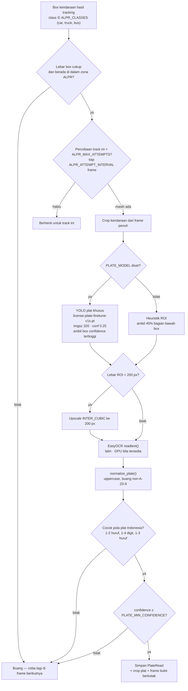
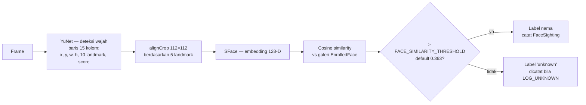
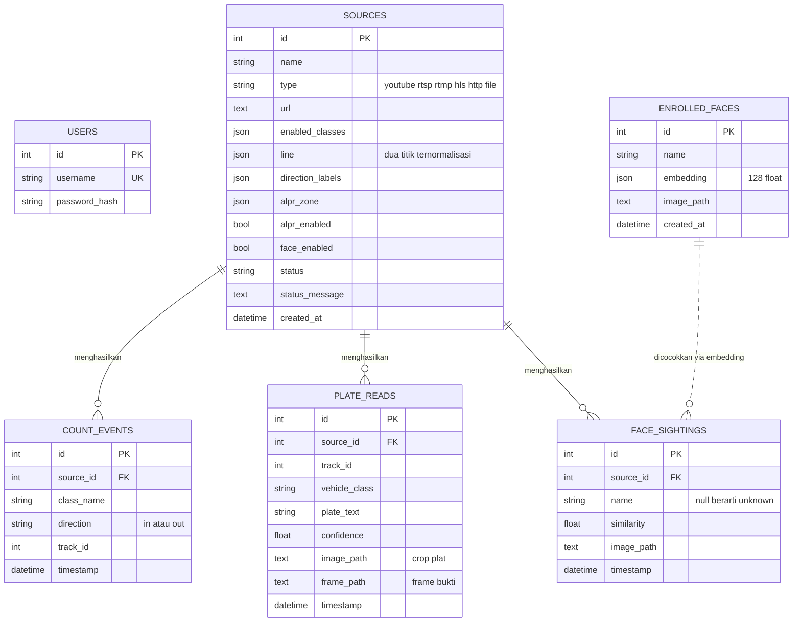
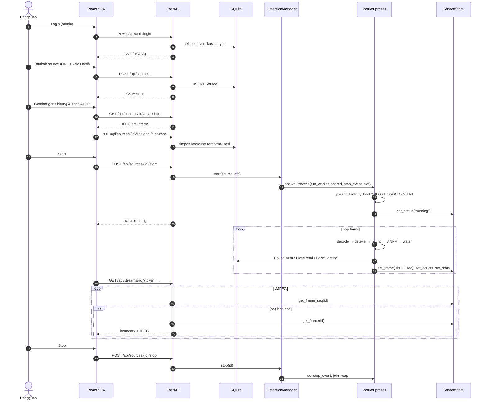
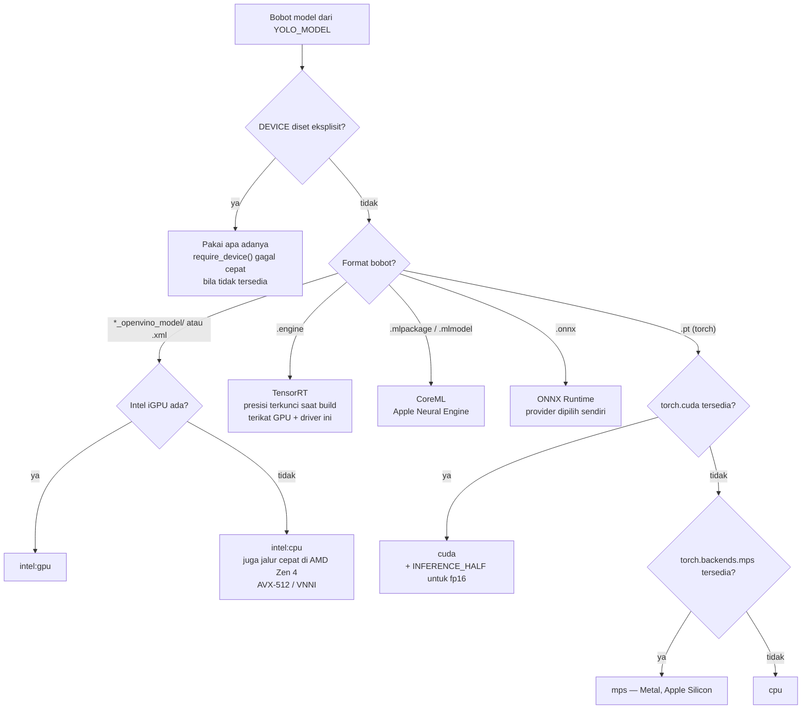
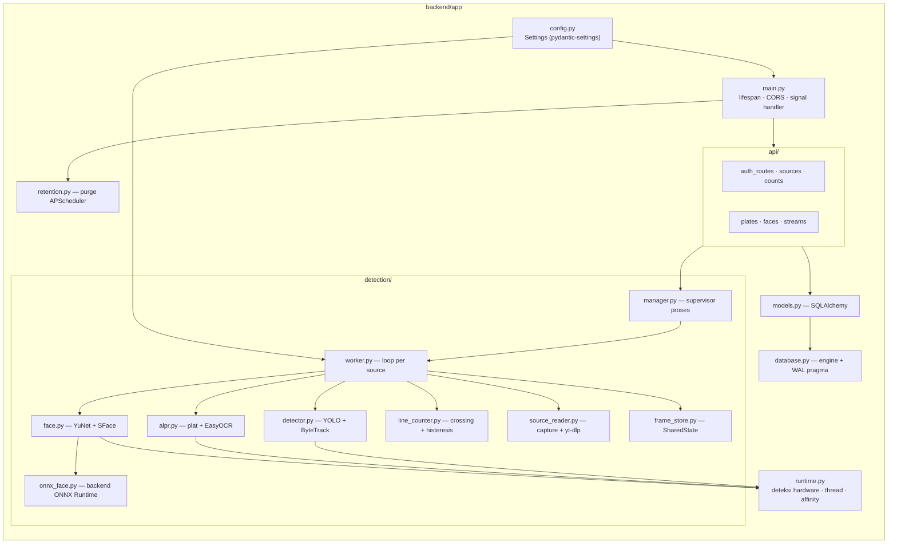

# Arsitektur Detection Dashboard

Dokumen ini menjelaskan arsitektur lengkap sistem: proses, thread, aliran data,
pipeline deteksi, skema database, dan jalur inferensi per perangkat keras.

Semua diagram ditulis dalam **Mermaid**, jadi langsung ter-render di GitHub,
GitLab, dan preview Markdown VS Code. Untuk membukanya sebagai halaman HTML
biasa, lihat [Membuka sebagai HTML](#membuka-sebagai-html) di bagian akhir.

---

## 1. Arsitektur keseluruhan

Satu proses FastAPI melayani API + SPA, dan menyalakan **satu proses worker per
source**. Kedua sisi bertukar data lewat `multiprocessing.Manager`, bukan lewat
database — frame JPEG terlalu panas untuk lewat SQLite.



**Kenapa proses terpisah, bukan thread?** GIL Python akan membuat 4–10 stream
saling menunggu di loop deteksi. `spawn` dipakai (bukan `fork`) karena wajib di
Windows dan paling aman saat torch/CUDA di-load di dalam worker.

---

## 2. Anatomi satu worker

Satu source = satu proses, dan di dalamnya ada **tiga thread pembantu** supaya
loop deteksi tidak pernah menunggu I/O, OCR, atau encoding JPEG.



Detail yang tercermin di kode:

- **Deteksi jalan tiap `frame_stride` frame**, tapi preview tetap menerima semua
  frame — video terlihat mulus walau inferensi lebih jarang.
- **ANPR meng-crop dari frame resolusi penuh**, bukan dari frame yang sudah
  di-downscale, supaya teks plat tetap terbaca. `detect_scale` yang mengembalikan
  koordinat box ke skala penuh.
- **Publisher adalah thread sendiri** karena anotasi + `imencode` cukup mahal dan
  tidak boleh menahan frame berikutnya.
- `frame_seq` (dict kecil) dipisah dari `frames` (puluhan KB) supaya klien MJPEG
  bisa cek "berubah tidak?" tanpa menarik JPEG lewat pickle round-trip.
- Line counting memakai **titik kontak roda**, bukan titik tengah box, plus pita
  histeresis — tanpa itu box yang bergoyang di dekat garis menghasilkan 8,5%
  hitungan berlebih untuk mobil dan 18,5% untuk truk pada feed uji.

---

## 3. Pipeline ANPR (plat nomor Indonesia)

Dua tahap: **lokalisasi** lalu **OCR**, dengan dua lapis validasi setelahnya.



**Kenapa dua lapis validasi?** Regex saja lemah — plat buram di kejauhan tetap
menghasilkan string yang *cocok polanya* tapi salah isinya. Karena plat salah
lebih buruk daripada tidak ada plat, hasil di bawah ambang confidence dibuang dan
kendaraan dicoba lagi pada frame yang lebih dekat.

**Kenapa motor dikecualikan secara default?** Plat motor Indonesia kira-kira
setengah lebar plat mobil, posisinya rendah dan sering menyudut. Pada feed
persimpangan contoh, motor adalah 77% kendaraan yang melintas dan menghasilkan
**nol** pembacaan — sambil menghabiskan 77% anggaran OCR milik mobil dan truk
yang sebenarnya terbaca. Tambahkan kembali bila kamera cukup dekat.

**Kenapa detector plat jauh lebih berharga daripada tuning OCR?** Heuristik "45%
bagian bawah" adalah sumber misread terbesar di pipeline ini; OCR yang bagus pun
tidak bisa menyelamatkan ROI yang salah.

---

## 4. Pipeline face recognition



Dua backend menjalankan **model yang sama** dan bisa ditukar lewat `FACE_BACKEND`:

| Backend | Runtime | 1 frame 720p, 5 wajah (RTX 5070 Laptop) |
|---|---|---|
| `onnx` (disarankan) | ONNX Runtime, CUDA | **16.0 ms** |
| `onnx` tanpa GPU | ONNX Runtime, CPU | 61.8 ms |
| `opencv` (fallback) | `cv2.dnn`, CPU saja | 86.9 ms |

Sekitar 3,9× dari total 5,4× percepatan datang dari pindah ke GPU, sisanya dari
runtime-nya sendiri. Build pip OpenCV tidak punya backend CUDA sama sekali, jadi
`cv2.FaceDetectorYN` selamanya di CPU — itulah alasan `onnx_face.py` ada.

> ⚠️ **Embedding kedua backend tidak kompatibel.** Pada input byte-identik,
> cosine similarity keduanya ~0,93, bukan 1,0 — evaluasi SFace di `cv2.dnn`
> menyimpang dari ONNX Runtime. Mengganti backend berarti **semua wajah harus
> di-enroll ulang**.

---

## 5. Skema database

SQLite mode WAL. Retensi otomatis menghapus baris **dan** file gambarnya.



Setiap `PlateRead` menyimpan **dua gambar**: crop platnya dan satu frame penuh
dengan kendaraannya dikotaki — supaya bisa dipastikan plat itu menempel pada
kendaraan yang mana.

---

## 6. Alur permintaan: dari tambah source sampai stream live



Endpoint MJPEG adalah generator tanpa akhir, jadi `main.py` memasang signal
handler sendiri: `SHUTTING_DOWN` di-set tepat saat Ctrl-C tiba, karena uvicorn
menjalankan lifespan shutdown **setelah** semua respons in-flight selesai — dan
tanpa itu kedua sisi saling menunggu.

---

## 7. Pemilihan device inferensi

`plan_inference()` di `detector.py` adalah satu-satunya tempat keputusan ini
dibuat — worker memakainya untuk anggaran thread CPU, dan `/api/health`
melaporkannya.



Anggaran CPU per worker (`runtime.py`): jumlah performance-core dibagi
`EXPECTED_STREAMS`, lalu tiap worker **di-pin ke irisan core-nya sendiri**.
Ini perlu karena env var jumlah thread tidak sampai ke semua backend — plugin
CPU OpenVINO menjadwal lewat TBB dan hanya menghormati affinity mask proses.

---

## 8. Peta modul



---

## 9. Ringkasan tech stack

| Lapisan | Teknologi |
|---|---|
| Frontend | React 18, React Router 6, TypeScript 5, Vite 6, Tailwind 3 |
| API | FastAPI 0.115, Uvicorn 0.34, Pydantic 2, python-multipart |
| Auth | PyJWT (HS256), bcrypt — satu admin |
| Database | SQLAlchemy 2.0 + SQLite (WAL) |
| Penjadwalan | APScheduler 3.11 (retensi otomatis) |
| **Deteksi objek** | **Ultralytics 8.3.200 (YOLO11)** + **ByteTrack** (solver `lap` 0.5.12) |
| **Baca plat** | **YOLO plat khusus** untuk lokalisasi + **EasyOCR 1.7.2** untuk OCR |
| Wajah | **YuNet** (deteksi) + **SFace** (embedding 128-D), via OpenCV DNN atau ONNX Runtime |
| Computer vision | OpenCV 4.11 (headless + reguler), NumPy 2.1, Pillow 11 |
| Input video | OpenCV/FFmpeg; **yt-dlp** untuk YouTube |
| Akselerator | torch CUDA (cu130), Apple MPS + CoreML/ANE, OpenVINO (Intel iGPU / CPU), TensorRT, ONNX Runtime |
| Distribusi | Docker + Compose (varian CPU & GPU), script setup native Windows/macOS |

Kelas COCO yang dipakai: `person` (0), `car` (2), `motorcycle` (3), `bus` (5),
`truck` (7) — dipilih per source lewat `enabled_classes`.

---

## Membuka sebagai HTML

Tiga cara, dari yang paling cepat:

1. **VS Code** — buka file ini lalu `Ctrl+Shift+V` (Markdown Preview). Mermaid
   ter-render bila ekstensi *Markdown Preview Mermaid Support* terpasang.
2. **GitHub / GitLab** — push, lalu buka file-nya. Mermaid ter-render otomatis.
3. **HTML mandiri** — konversi sekali dengan pandoc:

   ```bash
   pandoc docs/ARCHITECTURE.md -s -o docs/architecture.html \
     --metadata title="Arsitektur Detection Dashboard"
   ```

   Karena pandoc tidak me-render Mermaid sendiri, tambahkan skripnya di HTML
   hasil konversi (satu tag `<script type="module">` yang mengimpor
   `mermaid.esm.min.mjs` lalu memanggil `mermaid.initialize({startOnLoad:true})`),
   atau pakai `mermaid-cli` untuk mengubah tiap blok jadi SVG lebih dulu.
